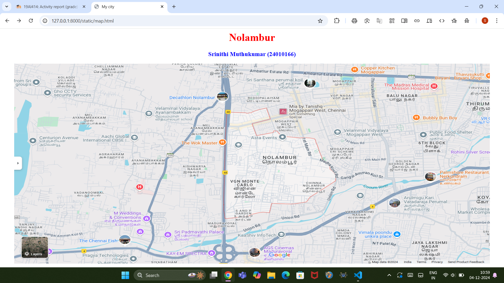
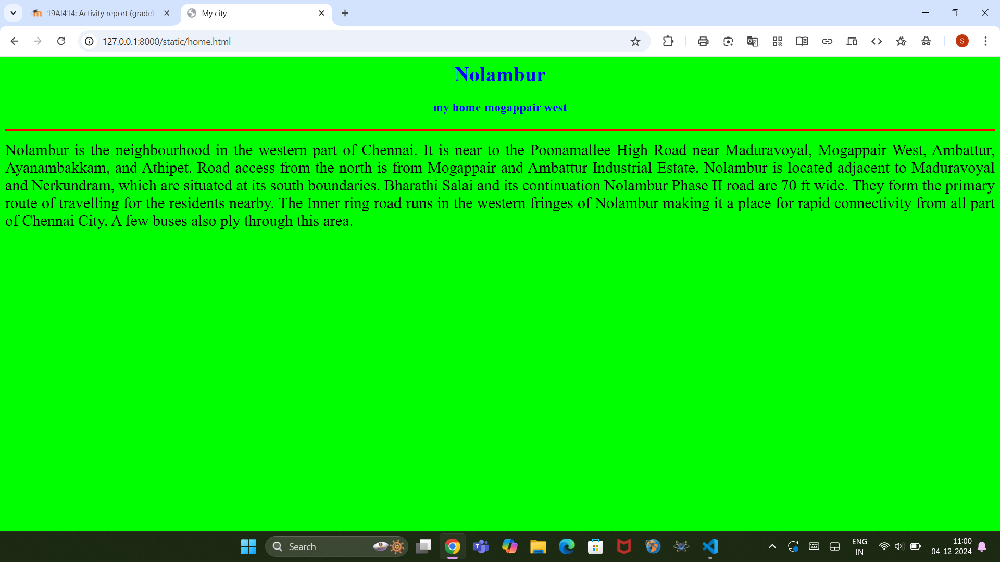
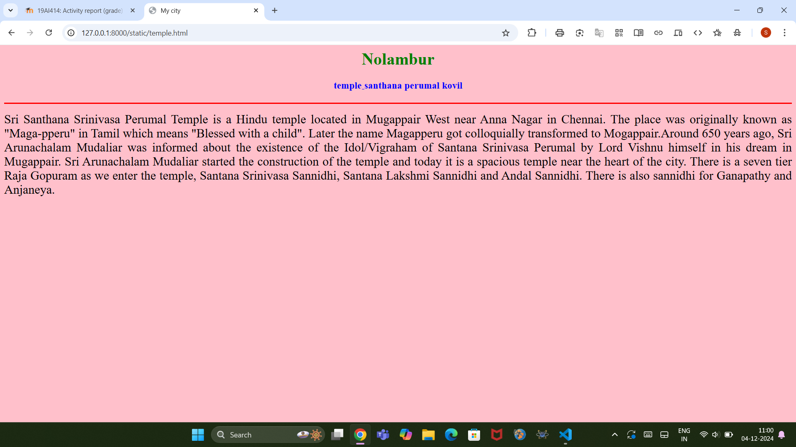
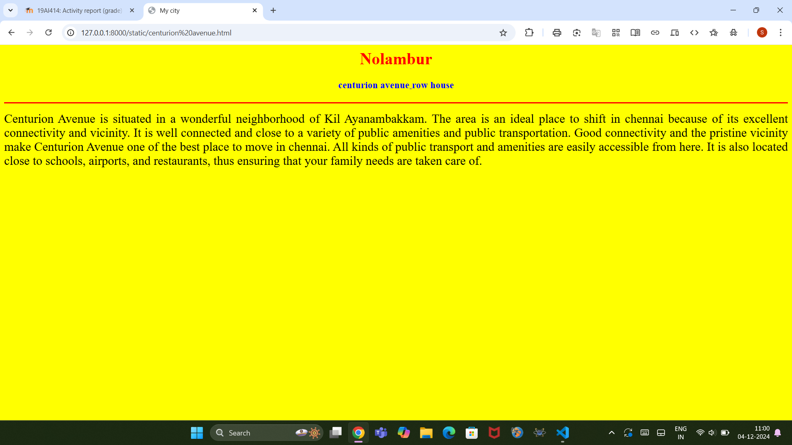
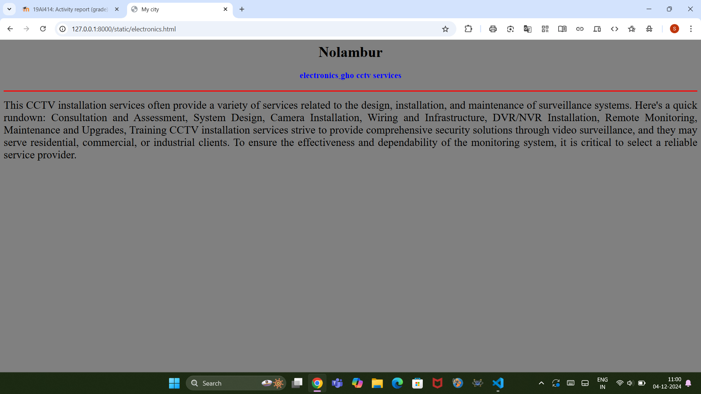
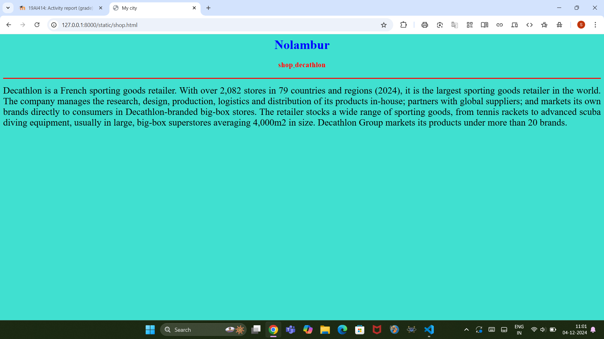

# Ex04 Places Around Me
## Date: 4.12.2024

## AIM
To develop a website to display details about the places around my house.

## DESIGN STEPS

### STEP 1
Create a Django admin interface.

### STEP 2
Download your city map from Google.

### STEP 3
Using ```<map>``` tag name the map.

### STEP 4
Create clickable regions in the image using ```<area>``` tag.

### STEP 5
Write HTML programs for all the regions identified.

### STEP 6
Execute the programs and publish them.


## CODE
```
map.html

<html>
<head>
    <title>My city</title>
</head>
<body>
    <h1 align="center">
    <font color="red"><b>Nolambur</b></font>
    </h1>
    <h3 align="center">
    <font color="blue"><b>Srinithi Muthukumar (24010166)</b></font>
    </h3>
    <center>
        
        <map name="My city">
        <area shape="rect" coords="800,300,850,400" href="home.html" title="My Home Town">
        <area shape="circle" coords="140,202,30,20" href="centurion avenue.html" title="centurion avenue">
        <area shape="circle" coords="500,50,50,20"   href="shop.html" title="decathlon">
        <area shape="circle" coords="754,109,100,10"   href="temple.html" title="sri santhana perumal kovil">
        <area shap="circle"  coords="105,90,50,30"   href="electronics.html" title="gho cctv services">
        </map>
    </center>
</body>
</html>


home.html


<html>
    <head>
        <title>My city</title>
    </head>
    <body bgcolor="lime">
    <h1 align="center">
        <font color="blue"><b>Nolambur</b></font>
    </h1>
      <h3 align="center">
        <font color="blue"><b>my home<sub>-</sub>mogappair west</b></font>
    </h3>
    <hr size="3" color="red">
    <p align="justify">
        <font face="Home" size="5">
            Nolambur is the neighbourhood in the western part of Chennai. 
            It is near to the Poonamallee High Road near Maduravoyal, Mogappair West, Ambattur, Ayanambakkam, and Athipet.
          Road access from the north is from Mogappair and Ambattur Industrial Estate. 
         Nolambur is located adjacent to Maduravoyal and Nerkundram, which are situated at its south boundaries. 
       Bharathi Salai and its continuation Nolambur Phase II road are 70 ft wide. They form the primary route of travelling for the residents nearby.
      The Inner ring road runs in the western fringes of Nolambur making it a place for rapid connectivity from all part of Chennai City.
    A few buses also ply through this area.
        </font>
    </p>
    </body>
</html>


centurion avenue.html


<html>
    <head>
        <title>My city</title>
    </head>
    <body bgcolor="yellow">
    <h1 align="center">
        <font color="red"><b>Nolambur</b></font>
    </h1>
      <h3 align="center">
        <font color="blue"><b>centurion avenue<sub>-</sub>row house</b></font>
    </h3>
    <hr size="3" color="red">
    <p align="justify">
        <font face="avenue" size="5">
            Centurion Avenue is situated in a wonderful neighborhood of Kil Ayanambakkam. The area is an ideal place to shift in chennai because of its excellent connectivity and vicinity.
            It is well connected and close to a variety of public amenities and public transportation.
            Good connectivity and the pristine vicinity make Centurion Avenue one of the best place to move in chennai.
           All kinds of public transport and amenities are easily accessible from here.
         It is also located close to schools, airports, and restaurants, thus ensuring that your family needs are taken care of.
        </font>
    </p>
    </body>
</html>


temple.html


<html>
    <head>
        <title>My city</title>
    </head>
    <body bgcolor="pink">
    <h1 align="center">
        <font color="green"><b>Nolambur</b></font>
    </h1>
      <h3 align="center">
        <font color="blue"><b>temple<sub>-</sub>santhana perumal kovil</b></font>
    </h3>
    <hr size="3" color="red">
    <p align="justify">
        <font face="temple" size="5">
            Sri Santhana Srinivasa Perumal Temple is a Hindu temple located in Mugappair West near Anna Nagar in Chennai.
            The place was originally known as "Maga-pperu" in Tamil which means "Blessed with a child".
            Later the name Magapperu got colloquially transformed to Mogappair.Around 650 years ago, Sri Arunachalam Mudaliar was informed about the existence of the Idol/Vigraham of Santana Srinivasa Perumal by Lord Vishnu himself in his dream in Mugappair.
            Sri Arunachalam Mudaliar started the construction of the temple and today it is a spacious temple near the heart of the city.
            There is a seven tier Raja Gopuram as we enter the temple, Santana Srinivasa Sannidhi, Santana Lakshmi Sannidhi and Andal Sannidhi.
            There is also sannidhi for Ganapathy and Anjaneya.
        </font>
    </p>
    </body>
</html>


electronics.html


<html>
    <head>
        <title>My city</title>
    </head>
    <body bgcolor="grey">
    <h1 align="center">
        <font color="black"><b>Nolambur</b></font>
    </h1>
      <h3 align="center">
        <font color="blue"><b>electronics<sub>-</sub>gho cctv services</b></font>
    </h3>
    <hr size="3" color="red">
    <p align="justify">
        <font face="electronics" size="5">
            This CCTV installation services often provide a variety of services related to the design, installation, and maintenance of surveillance systems.
            Here's a quick rundown:
             Consultation and Assessment,
             System Design,
             Camera Installation,
           Wiring and Infrastructure,
           DVR/NVR Installation,
         Remote Monitoring,
         Maintenance and Upgrades,
        Training
        CCTV installation services strive to provide comprehensive security solutions through video surveillance, and they may serve residential, commercial, or industrial clients.
        To ensure the effectiveness and dependability of the monitoring system, it is critical to select a reliable service provider.
  </font>
    </p>
    </body>
</html>

```

    


## OUTPUT








## RESULT
The program for implementing image maps using HTML is executed successfully.
